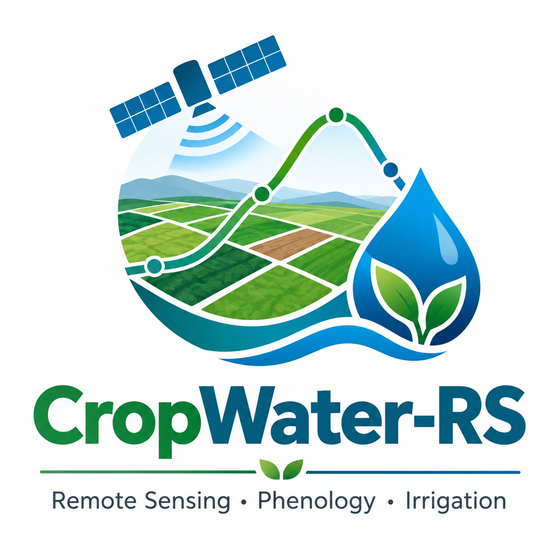

# CropWater-RS

<p align="center">
  
</p>

**Remote Sensing · Phenology · Irrigation**

CropWater-RS is a desktop scientific application for parcel-level crop monitoring and irrigation-water analysis using Sentinel-2 vegetation dynamics and user-supplied meteorological data.

## Main capabilities

- Import polygon parcels from SHP, GeoPackage and GeoJSON.
- Assign crop labels manually or in batch from user-selected vector attributes.
- Retrieve Sentinel-2 L2A parcel statistics through the Copernicus Data Space Ecosystem (CDSE).
- Calculate parcel-level NDVI with SCL-based quality masking.
- Reconstruct temporal trajectories using Linear, Whittaker, Savitzky-Golay or Kalman methods.
- Apply direct literature-based Kc–NDVI relationships at parcel level.
- Estimate ETc/CWR as `Kc × ETo`.
- Optionally estimate simplified net IWR as `max(ETc - Pe, 0)`.
- Perform parcel-wise QUANT phenological partitioning on reconstructed daily NDVI.
- Summarize CWR/IWR by QUANT-derived phases.
- Visualize NDVI, Kc/CWR/IWR and parcel-level spatial results.
- Export CSV, GeoPackage and reproducibility metadata.

## Scientific workflow

`Sentinel-2 L2A → parcel NDVI → temporal reconstruction → Kc → ETc/CWR → optional net IWR`

An independent QUANT module can additionally derive FAO-56-style phase boundaries from each parcel's reconstructed daily NDVI curve.

## Installation

Recommended: Python 3.12 in a clean environment.

```bash
python -m venv .venv
.venv\Scripts\activate
pip install -r requirements.txt
python cropwater_rs.py
```

## CDSE credentials

CropWater-RS uses user-owned Copernicus Data Space Ecosystem OAuth credentials. Never commit or publish a Client Secret.

## Parcel attributes

Crop labelling can be manual or imported from vector attributes. The application proposes `parcel_id`/`ID` and `crop`/`CROPS`, but any suitable columns can be selected.

## Meteorological CSV

For ETc/CWR:

```text
Date,ETo
2026-01-01,1.9
```

For simplified net IWR:

```text
Date,ETo,Pe
2026-01-01,1.9,0.0
```

An optional `parcel_id` column can provide parcel-specific meteorology.

## Important methodological note

`ETc = Kc × ETo`

`IWRnet,d = max(ETc,d - Pe,d, 0)`

The implemented net IWR is a simplified daily requirement, not a complete soil-water balance. It does not represent soil-water storage, runoff, deep percolation, capillary rise or irrigation efficiency.

## QUANT

QUANT is applied independently to each parcel's reconstructed daily NDVI curve. The user controls the amplitude percentages used to determine transitions. Default thresholds follow French et al. (2023): 10% and 90% on the rising limb, 90% on the falling limb for the end of mid-season, and 50% on the falling limb for end of season.

See `docs/QUANT_METHOD.md`.

## Kc–NDVI library

The built-in catalogue distinguishes primary-source-verified entries from relationships still requiring primary-source audit. User-defined relationships are explicitly marked as unverified.

See `docs/KC_NDVI_LIBRARY.md`.


## Repository

Official source repository:

`https://github.com/avalero92/CropWater-RS`

## Citation

Provisional citation:

> Valero-Jorge, A. (2026). *CropWater-RS* (Version 1.0.0) [Computer software].

After Zenodo assigns a DOI, add it to `software_metadata.json`, `CITATION.cff` and this README.

## License

GNU General Public License v3.0 only (`GPL-3.0-only`). See `LICENSE`.

## Author

**Alexey Valero-Jorge**

> Affiliation: CENTRO DE INVESTIGACIÓN Y TECNOLOGÍA AGROALIMENTARIA DE ARAGÓN.
> ORCID: https://orcid.org/0000-0002-5993-7346
> Email: avalero@cita-aragon.es
> repository/DOI:
